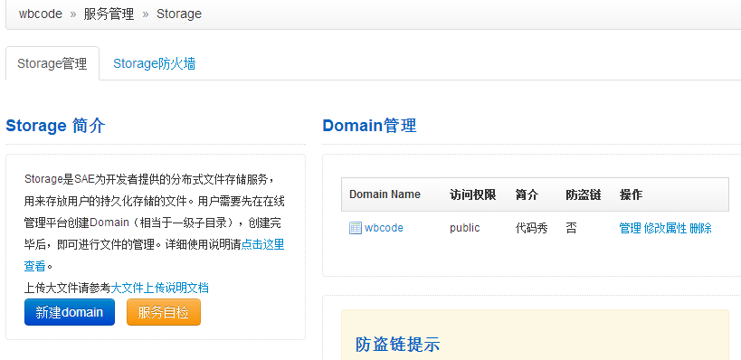
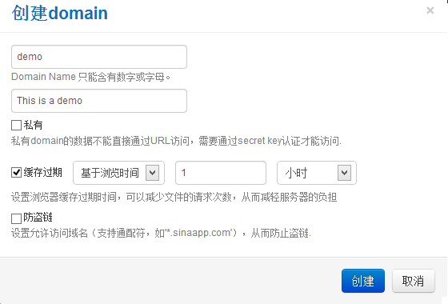
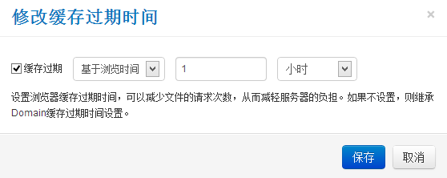
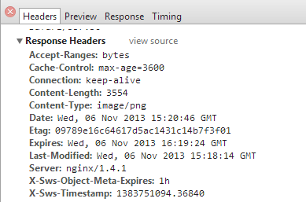
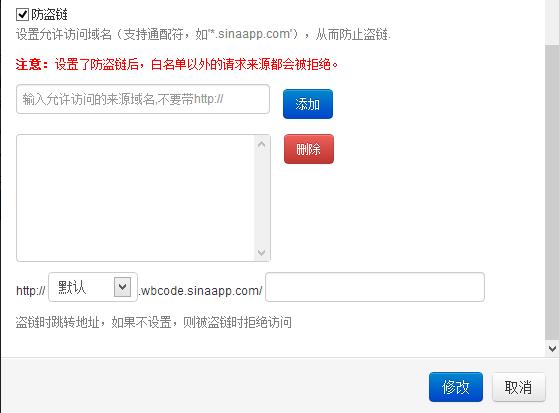

#Storage管理平台
在使用之前，先了解一下SAE对Storage的配额：
<table>
   <tr>
      <td>单一domain</td>
      <td>10GB起(企业用户可根据需要调整，不设上限)</td>
   </tr>
   <tr>
      <td>单一文件</td>
      <td>小于单一domain限制</td>
   </tr>
   <tr>
      <td>同一App最大domain数</td>
      <td>5</td>
   </tr>
   <tr>
      <td>同一用户所有app最大domain数</td>
      <td>10（企业用户50）</td>
   </tr>   
</table>

对于大多数应用，10G的存储空间已经绰绰有余。如果不够用，可以写邮件申请增加配额。据笔者经验，SAE客服的回复速度很快。

SAE提供了在线管理平台，方便开发者管理Storage，上传或删除文件，设置文件属性等。进入应用管理页面后，可以在左侧导航栏”服务管理”下方找到Storage管理入口。Storage的管理界面如下图。

##创建Domain
在应用中使用Storage，首先要创建Domain。Domain相当于一级目录，和虚拟主机上的文件夹概念一致。

在Storage的管理界面中，点击左侧的“新建domain”按钮可以创建domain，。右侧是现有Domain的管理列表，你可以进行文件管理、属性修改和删除操作。

如果你还没有创建过domain，可以点“新建domain”按钮，页面会弹出一个“创建domain”的浮层。其中Domain Name是必填项，其余项都是可选。

创建Domain后，就可以进行文件的管理了。SAE提供了可视化的操作界面，这里不在赘述。

##Domain属性解读
在“创建domain“ 的浮层中，有两个选项值得注意。

###1.缓存过期时间
一个文件若被设置了浏览器缓存过期时间，浏览器访问该文件时,会判断上次访问缓存的文件是否过期；若没过期，就直接从缓存中读取，不会再访问服务器。Storage提供了两种缓存过期方式：基于浏览时间和基于上传时间。前者从浏览器角度出发，在过期时间内不会去重复请求服务器，适用于在一段时间内不会修改的文件，如图片、pdf文档等；后者从服务器角度出发，过期时间基于文件的上传时间或修改时间（因为Storage的api可以修改文件及其属性，后续会详细叙述），适用于内容可能会变化的文件。

为验证缓存过期，我将一个图片的缓存过期时间设置为基于浏览时间1小时。
 

在chrome的网络选项中可以看到图片的响应头部如下

 
可以看到这样三行：

    Expires:Wed, 06 Nov 2013 16:19:24 GMT 过期时间
    Last-Modified:Wed, 06 Nov 2013 15:18:14 GMT 上次访问时间
    X-Sws-Object-Meta-Expires:1h 缓存时间1小时
说明Storage的缓存策略生效了。

###2.防盗链
盗链是指网站引用别人服务器上的资源，消耗其带宽，而未给其带来点击量。在SAE上，节省云豆的一个最简单的方法是设置防盗链。
SAE的防盗链采用白名单策略，不在白名单的请求都会被拒绝。
